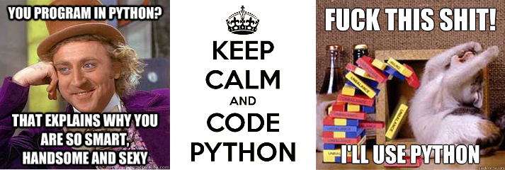

## Praktyczne zastosowanie języka Python w biologii obliczeniowej

---

## Informacje o przedmiocie:

<table>
  <tbody> 
    <tr>
      <td>Kierunek studiów</td>
      <td>Bioinformatyka 2 rok</td>
    </tr>
    <tr>
      <td>Prowadzący</td>
      <td>dr Andrzej Zieleziński</td>
    </tr>
    <tr>
      <td>Czas trwania</td>
      <td>30h</td>
    </tr>
    <tr>
      <td>Zakres kursu (słowa kluczowe)</td>
      <td>
        <a href="https://www.python.org" target="_blank">#python</a>, 
        <a href="http://biopython.org" target="_blank">#biopython</a>, #sekwencje, #DNA, #RNA, #białko, #genom</td>
    </tr>
  </tbody>
</table>

 

## Spis treści:

#### 1. Typy i operacje
* lab01 - Liczby, Boolean, Ciągi znaków [[tutorial](./tutorials/L01-numbers_bool_strings.ipynb)] [[zadania](./exercises/Ex01.md)]
* lab02 - Listy, Słowniki [[tutorial](./tutorials/L02-lists_dictionaries.ipynb)] [[zadania](./exercises/Ex02.md)]
* lab03 - Zbiory, Krotki, Pliki [[tutorial](./tutorials/L03-sets_tuples_files.ipynb)][[zadania](./exercises/Ex03.md)]

#### 2. Instrukcje i składnia
* lab04 - Instrukcja `if`, pętle `for` i `while` [[tutorial](./tutorials/L04-if_for_while.ipynb)][[zadania](./exercises/Ex04.md)]
* lab05 - Funkcje i moduły (1)
* lab06 - Funkcje i moduły (2)

#### 3. Programownie zorientowane obiektowo
* lab07 - Klasy (1) 
* lab08 - Klasy (2)

#### 4. Narzędzia Pythona (opracowanie tematów przygotowują studenci 1-2 os.)
* lab09
    * Wyrażenia regularne (moduł `re`)
    * Pobieranie danych z internetu (moduł `urllib2`)
    * Obsługa wyjątków (`try` / `except` / `else`)
* lab10
    * Interfejs obsługi skryptów (moduł `argparse`)
    * Praca z systemem operacyjnym (moduły `os` i `subprocess`)
    * Funkcje anonimowe (wyrażenie `lambda`)
    * Funkcje `map`, `reduce` i `filter`

#### 5. Biblioteka BioPython
* lab 11 - Moduł `Bio.SeqIO`
* lab 12 - Moduł `Bio.AlignIO`

#### 6. Projekt (1- lub 2-osobowe zespoły)
* lab 13 - Praca nad projektem (1)
* lab 14 - Praca nad projektem (2)
* lab 15 - Prezentacja projektu

 
## Forma zaliczenia:
Na ocenę końcową tego przedmiotu składają się:
* ocena wykonywanych przez studenta skryptów Pythona (waga: 50%)
* ocena odpowiedzi studenta na pytania dotyczące działania aplikacji (waga: 30%)
* obecność + aktywność na zajęciach (waga: 20%)

## Dobre praktyki
* [PEP 20 - The Zen of Python](https://www.python.org/dev/peps/pep-0020/) - filozofia Pythona w 20 wersach
* [PEP 8 - Style Guide for Python Code](https://www.python.org/dev/peps/pep-0008/) - jak pisać piękny kod Pythona

## Materiały dodatkowe:
1. Tutoriale (on-line):
   * [Oficjalny tutorial Python 3.5.2](https://docs.python.org/3/tutorial/)
   * Biopython Tutorial and Cookbook [[HTML](http://biopython.org/DIST/docs/tutorial/Tutorial.html)] [[PDF](http://biopython.org/DIST/docs/tutorial/Tutorial.pdf)]
2. Gry / rozwiązywanie problemów (bio)informatycznych:
   * [Rosalind](http://rosalind.info/problems/list-view/)
   * [StackOverflow](http://stackoverflow.com)
   * [BioStar](https://www.biostars.org)
3. YouTube:
   * [Python 3.4 Programming Tutorials](https://www.youtube.com/playlist?list=PL6gx4Cwl9DGAcbMi1sH6oAMk4JHw91mC_)
4. Książki:
   * Lutz M. Python. Wprowadzenie. Wydanie IV. Wydawnictwo HELION. 2011. [[księgarnia](http://helion.pl/ksiazki/python-wprowadzenie-wydanie-iv-mark-lutz,pytho4.htm)] [[PDF wersja angielska](http://stock.ethop.org/pdf/python/Learning%20Python,%205th%20Edition.pdf)]
5. Artykuły naukowe:
   * Ekmekci i in. An Introduction to Programming for Bioscientists: A Python-Based Primer. *PLOS Computational Biology*. 2016 [[PDF](http://journals.plos.org/ploscompbiol/article/asset?id=10.1371%2Fjournal.pcbi.1004867.PDF)]