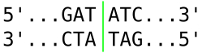

## Zad. 1
Utwórz funkcję **`hamming_distance`**, która przyjmuje od użytkownika dwie sekwencje równej długości i oblicza między nimi [dystans Hamminga](https://pl.wikipedia.org/wiki/Odległość_Hamminga) - liczba miejsc (pozycji), na których dwie sekwencje się różnią.

Input:
```
GAGCCTACTAACGGGAT
CATCGTAATGACGGCCT
```

Output:
```
7
```


## Zad. 2
Utwórz funkcję **`seq_words`** tak aby w zadanej przez użytkownika sekwencji nukleotydowej/białkowej obliczała częstości występujących w niej subsekwencji o zadanej długości.

Input:
```
'MKSTMK', 2
```

Output:
```
{
  'MK': 0.4,
  'KS': 0.2,
  'ST': 0.2,
  'TM': 0.2
}
```


## Zad. 3
Bakterie wykorzystują enzymy restrykcyjne do walki z wirusami. Enzymy restrykcyjne rozpoznają w sekwencjach genomów wirusów palindromowe sekwencje DNA długości od 4 do 12 nukleotydów i w tych miejscach przeprowadzają rozcięcie cząsteczek wirusa. Przykładową sekwencją palindromową jest `GCATGC`, ponieważ jej sekwencja komplementarna to `GCATGC`.



Utwórz funkcję **`restriction_sites`**, która w zadanej przez użytkownika sekwencji DNA zidentyfikuje pozycję i długość wszystkich palindromowych sekwencji długości od 4 do 12 nukleotydów.

Input:
```
TCAATGCATGCGGGTCTATATGCAT
```

Output:
```
4 6
5 4
6 6
7 4
17 4
18 4
20 6
21 4
```